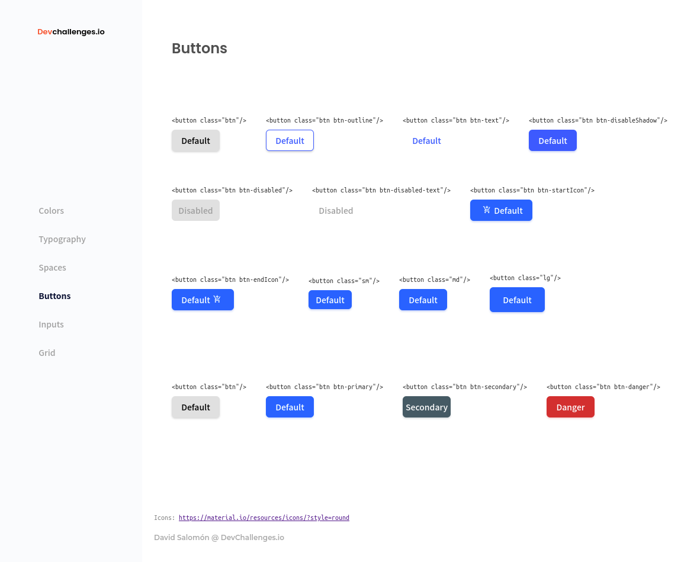

<!-- Please update value in the {}  -->

<h1 align="center">Button Component</h1>

<div align="center">
   Solution for a challenge from  <a href="https://devchallenges.io/challenges/ohgVTyJCbm5OZyTB2gNY" target="_blank">Devchallenges.io</a>.
</div>

<div align="center">
  <h3>
    <a href="https://button-component.salo777.vercel.app/1st+test/demo.html">
      Demo
    </a>
    <span> | </span>
    <a href="https://button-component.salo777.vercel.app/">
      Solution
    </a>
    <span> | </span>
    <a href="https://devchallenges.io/challenges/ohgVTyJCbm5OZyTB2gNY">
      Challenge
    </a>
  </h3>
</div>

<!-- TABLE OF CONTENTS -->

## Table of Contents

- [Overview](#overview)
- [Built With](#built-with)
- [Features](#features)
- [How to use](#how-to-use)
- [Contact](#contact)
- [Acknowledgements](#acknowledgements)

<!-- OVERVIEW -->

## Overview



This is a Frontend project where you have to create buttons for your website style guide.

- Where can I see your demo? You can check it on <a href="https://button-component.salo777.vercel.app/">
      Demo
    </a>
- What was your experience?
It was amazing, at the beggining I did a mess, but with the time you get more ideas on how to organize your icons and apply the style.
- What have you learned/improved? On how to create reusable components in other projects.
- Your wisdom? :) I need to practice more, but I'm on my way.

### Built With

<!-- This section should list any major frameworks that you built your project using. Here are a few examples.-->

- [HTML](https://developer.mozilla.org/en-US/docs/Web/HTML)
- [CSS](https://developer.mozilla.org/en-US/docs/Web/CSS)

## Features

<!-- List the features of your application or follow the template. Don't share the figma file here :) -->

This application/site was created as a submission to a [DevChallenges](https://devchallenges.io/challenges) challenge. The [challenge](https://devchallenges.io/challenges/ohgVTyJCbm5OZyTB2gNY) was to build an application to complete the given user stories.

## How To Use

<!-- This is an example, please update according to your application -->

To clone and run this application, you don't need something else rather than applying the different class styles on the demo

```bash
# Add the stylesheet to your HTML page
<link rel="stylesheet" href="https://button-component.salo777.vercel.app/buttons.css">

# Copy and past the classes on your buttons
<button class="btn"/><button>

# You can increase or decrease the button size by adding 
"sm" = Small
"md" = Medium
"lg" = Large
```

## Acknowledgements

<!-- This section should list any articles or add-ons/plugins that helps you to complete the project. This is optional but it will help you in the future. For exmpale -->

- [Steps to replicate a design with only HTML and CSS](https://devchallenges-blogs.web.app/how-to-replicate-design/)
- [Marked - a markdown parser](https://github.com/chjj/marked)

## Contact

- Website [david-salomon.com](https://david-salomon.com)
- GitHub [@salo777](https://github.com/salo777)
- Twitter [@davidsalomon777](https://twitter.com/davidsalomon777)
